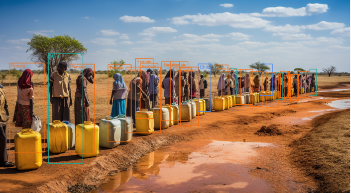

# Water Quality and Infrastructure Analysis
**Title:** Water Quality

This project analyzes water quality, infrastructure upgrades, and employee performance for various water sources. Using SQL, it integrates data from multiple tables to identify contamination issues, assess infrastructure needs, and monitor project progress.

## Project Overview

The analysis focuses on:

- Assessing water sources for contamination levels
- Identifying infrastructure needs for different water source types
- Monitoring employee contributions to improvement efforts
- Providing actionable recommendations (e.g., installing filters, addressing infrastructure faults)

## Database Structure

The project uses the following tables:

- **`visits`**: Logs water source visits, including queue times and assigned personnel
- **`well_pollution`**: Records contamination levels in well water.
- **`water_source`**:  Stores details on source type and population served.
- **`location`**: Contains geographic data, such as town, province, and address.
- **`Project_progress`**: Tracks improvement efforts, their status, and related comments.

## Key Features

1. **Progress Tracking**: Updates improvement recommendations based on contamination levels and queue durations.
2. **Employee Assessment**: Evaluates staff performance by comparing auditor and surveyor reports.
3. **Infrastructure Suggestions**: Generates targeted recommendations, such as adding taps for high-traffic areas.

## Running the Project

1. Import SQL files from the `/sql` directory. 
2. Load sample data using `data_loading.sql`.
3. Execute queries to generate insights, track progress, and refine recommendations.

## Access the Full Documentation

Dataset was provided by ALX [project documentation](https://alxafrica.com).
